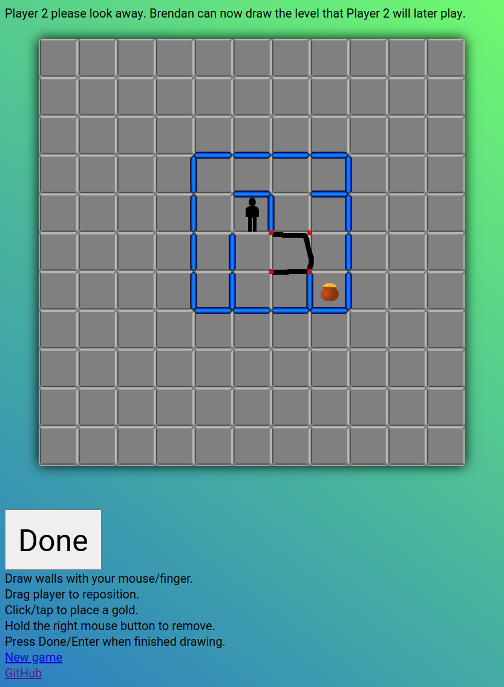
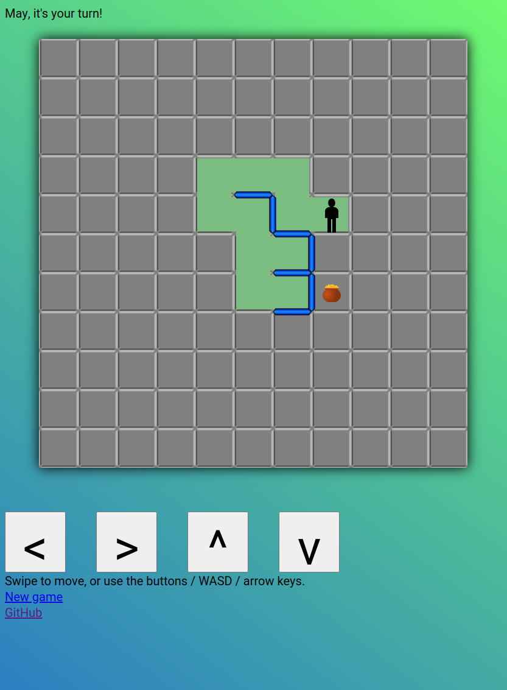

# PathFinder Elm

[](https://app.netlify.com/sites/pathfinder-elm/deploys)

## Contents

<details>
 <summary>Click to open table of contents</summary>
<!-- MarkdownTOC autolink=true -->

- [Gameplay](#gameplay)
- [Play](#play)
- [Screenshots](#screenshots)
- [Elm](#elm)
- [History](#history)
- [Development](#development)
    - [Dependencies](#dependencies)
        - [With Docker](#with-docker)
        - [Without Docker](#without-docker)
    - [Prepare database](#prepare-database)
    - [Run](#run)
        - [With Docker](#with-docker-1)
        - [Without Docker](#without-docker-1)
    - [Build](#build)
        - [With Docker](#with-docker-2)
        - [Without Docker](#without-docker-2)
    - [Test](#test)
        - [With Docker](#with-docker-3)
        - [Without Docker](#without-docker-3)
- [Todo](#todo)

<!-- /MarkdownTOC -->
</details>

## Gameplay

PathFinder is a multiplayer maze game playable in your web browser, based on a 1974 board game of the same name. Two players secretly draw a maze for each other on a grid, placing the starting point and at least one goal (a pot of gold). Once ready, all the walls turn invisible. The players then take turns making their way towards a gold. When a wall is hit, that wall becomes visible, and it switches turn. First to a gold wins! 🏆️

It's a simple game, and it's great fun trying to anticipate what your friends will do and trying to outsmart them! 🧠 How good of a maze creator are they? Will they start by heading directly towards the gold? Will they try every possibility on the way, or move ahead blindly? Will they fall for the trap of this dead end? Should you try reverse-psychology, or perhaps reverse-reverse-psychology? Where on the board are even the edges of a size-bounded maze? Good luck! 🚀

Tip: given it takes some time to draw a maze, for a shorter game, agree on a size for the dimensions of your mazes. Draw a box of that size, then make the maze within. 6x6 is a good starting point, and I play that often.

## Play

The game supports both same-device multiplayer and multi-device multiplayer; the latter is pretty basic so far though, so don't move your opponent when it's their turn! 😉

You can play the game here:

➡️➡️➡️ **https://pathfinder-elm.netlify.app** ⬅️⬅️⬅️

## Screenshots

 

## Elm

I'm using this an opportunity to learn a pure Functional Programming language! 😁 Elm seems like a great choice for its ease of use, and I'm finding the [Elm Guide](https://guide.elm-lang.org/) very approachable ❤️

My hope is for this modern rewrite to eventually be able to run on smartphones as an installable app 📱

As much as I dislike PHP, I chose to use that to write the backend, since I only needed something simple and it would allow it to be cloud-hosted for free (on my legacy DreamHost server I already have) 💸

## History

This is my fourth attempt at writing an implementation of the game.

Versions:

- [GameMaker (the most complete)](http://www.zimbico.net/games/pathfinder/) -- 2008-2011
- Pascal using SwinGame - for a uni project -- 2012
- GameMaker Studio (Android spike) -- 2013
- This one! -- 2020-

## Development

### Dependencies

#### With Docker

Install:

- Docker
- Docker Compose

#### Without Docker

To install development dependencies (only supports Arch Linux, currently):

```bash
$ ./scripts/setup
```

### Prepare database

```bash
$ ./auto/dev curl -sSN 'backend/backend/db-setup.php?reset&password=pathfinder_elm'
```

### Run

To run the app with live reload on code changes:

#### With Docker

```bash
$ ./auto/start
```

#### Without Docker

```bash
$ ./scripts/start
```

### Build

To build the app to the `dist` folder:

#### With Docker

```bash
$ ./auto/build
```

#### Without Docker

```bash
$ ./scripts/build
```

### Test

To runs the tests:

#### With Docker

```bash
$ ./auto/test
```

#### Without Docker

```bash
$ ./scripts/test
```

## Todo

- Unit tests - higher-level tests were blocked by being [unable to instantiate a model containing a `Browser.Navigation.Key`](https://github.com/elm-explorations/test/issues/24), but I found I can instead use elm-spec
- Allow two players to draw their maze simultaneously on each device
- Handle retryable failure when submitting an event - not HTTP 409 Conflict
- Fix bug where name prompt is shown again after submitting blank then right-clicking
- Poll for new events faster when the last event was very recent
- Prevent lag causing a bounce off the edge of the maze one square too early
- Fix sync bug - need to work out how to reproduce - if still present after having rearchitected tracking current state version
- Fix bug where completing a game in one window makes the other get stuck with an invisible popup
- Make dismissing first win popup not immediately switch maze, but rather enable a button to continue
- Submit the next game ID in an initial event so the 'New game' links are in sync
- Make new game event prompt "Your opponent started a new game" before redirecting
- Generate UUID to identify the user, and store in local storage - only when missing
- Resume as the right player upon a page reload
- Add fast-forward button to instantly replay game history upon page reload part-way through a game (no animation), but preserve how receiving an event from the opponent applies it as normal interaction (with animation)
- Disable local interaction while it's the opponent's move
- Display link for sharing with a friend to play against
- Call `switchMazes` from somewhere better
- Count moves and wall hits and show this in the winning message
- Prevent touchscreen button lag
- User login
- Allow changing grid size
- Saving a maze to be able to reuse it
- Fade in new sections of traversed path
- Switch from `List.concat` to `(::)` operator
- Prevent line drawing craziness on multitouch - check pointer ID is 1?
- Automatically resize to fit viewport - probably requires modifying the HTML page template
- Hold with a second finger to remove / tap and hold then drag?
- Split out to multiple files
- Deduplicate walls when finishing drawing
- Deduplicate golds
- Deduplicate path travelled
- Different background colour for each maze within a game
- Compensate for overshooting the point of collision in `returnToOriginIfPathUnclear`
- Preload images
- Fix bug where the game freezes when 'New game' is clicked while replaying events
